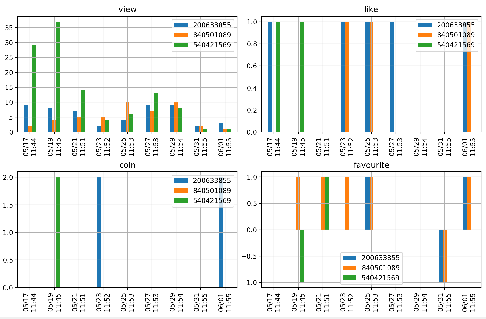
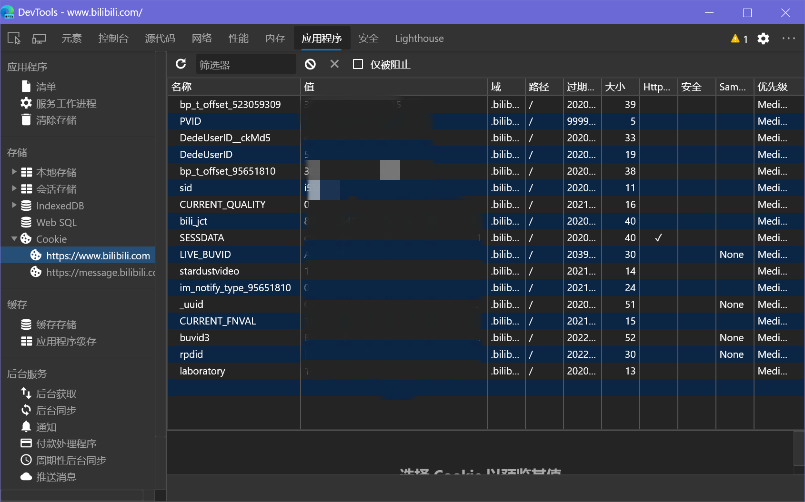
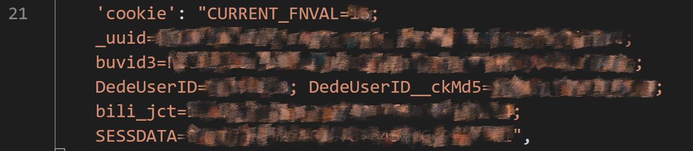
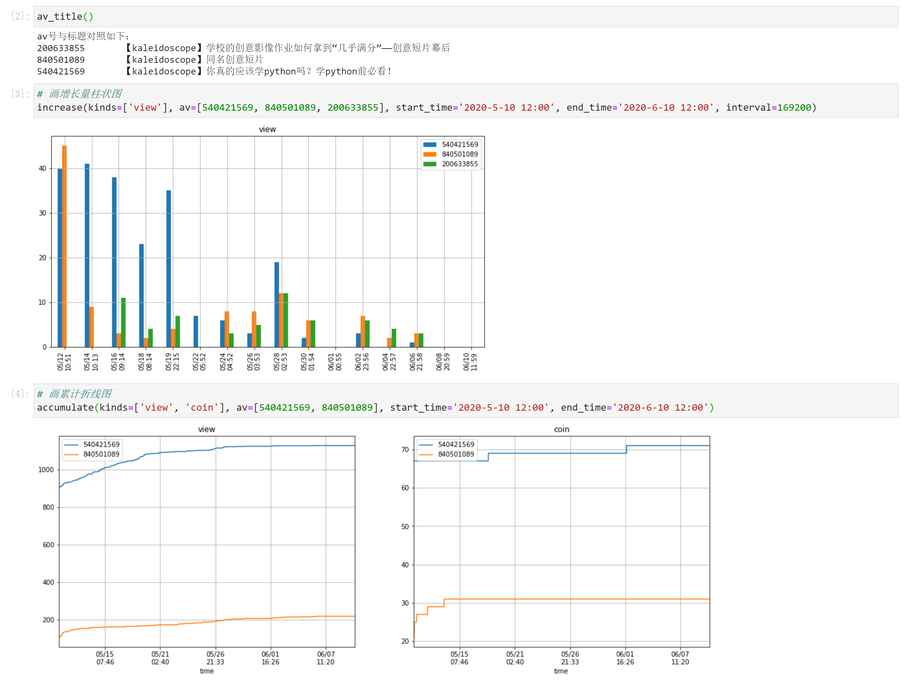
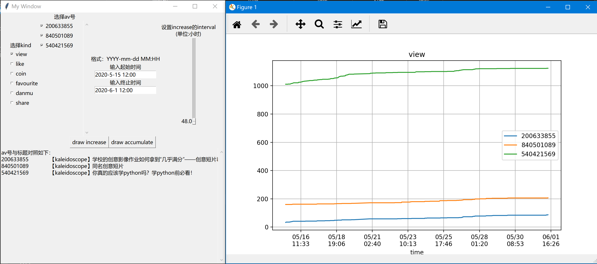
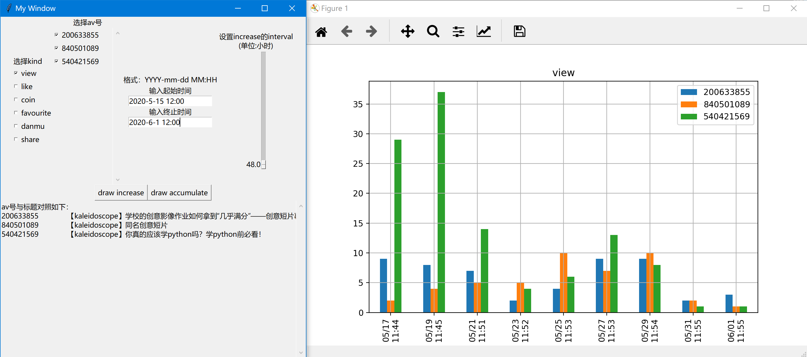

# bilibili-data-assistant (B站稿件数据记录及可视化)
B站up主的好助手。记录所有自己投稿稿件的各类历史数据(播放量、点赞、投币、评论、收藏、转发、评论数)并进行可视化。

特点：
1. 实时记录所有自己投稿稿件的各类数据(播放量、点赞、投币、评论、收藏、转发、评论数)，便于进行观众的行为分析。

2. 可以分时段看到数据的变化情况，便于优化自己的投稿时间。

3. 从`创作中心--稿件管理`获取数据，所以新投稿的视频也会自动开始记录。

4. 数据可视化，通过参数灵活调整显示的数据类型和时间段。

5. 如果程序意外退出，重新运行即可，之前的数据会被保留。

## 总览
基于Python3，所需的第三方包有：`Pandas`和`Matplotlib`。

程序分为两个部分：
- **收集数据**  
由`collector.py`实现，每间隔一段时间将数据记录并保存到`time_series.pkl`中，需要一直保持后台运行。  
- **查看数据**
读取`time_series.pkl`中的数据并通过`Matplotlib`进行数据可视化。
提供了三种方式，分别为`viewer.py`, `viewer.ipynb`, `viewer_GUI.py`。

## 使用
### 0 环境
基于python3，所需的第三方包有：`Pandas`和`Matplotlib`。上述两个库需要(通过`pip`等命令)额外安装。然后将程序通过`git`命令等下载到本地。

### 1 数据收集(`collector.py`)
用浏览器登录B站，查看你的cookie。

**修改**`collector.py`中第21行对应的cookie。

**修改**最后一行`time.sleep()`中的秒数，以修改获取数据的间隔时间。默认为1800秒，即每半小时更新记录一次数据。

运行`collector.py`，注意使其保持一直运行。

程序会生成`time_series.pkl`文件，是保存的数据文件。

如果程序意外退出，重新运行即可，之前的数据会被保留。

### 2 数据查看

#### 2.1 `viewer.py`
`viewer.py`的提供了三个函数：
- `accumulate(kinds, av, start_time, end_time)`
- `increase(kinds, av, start_time, end_time, interval)`
- `av_title()`

前两者分别用于画**累计数据的折线图**和**指定时间间隔的增长量柱状图**，最后一个函数用于打印视频**av号与标题的对照**。

具体参数如下：

|参数|说明|
|---|---|
|`kinds`|在一张图表中绘制多子图同时显示指定的数据。接受`list`类型，其中元素可以填`'view'` `'like'` `'coin'` `'favourite'` `'share'` `'danmu'` `'reply'`|
|`av`|指定要画图的视频。接受`list`类型，其中的元素为视频av号(类型为`int`)，|
|`start_time` `end_time`|指定起止时间。接受`string`类型，格式为`'YYYY-mm-dd MM:HH'` 如 `'2020-05-05 15:05'`|
|`interval`|针对`increase()`函数有效，设置时间间隔。接受`int`类型，单位为`秒`，默认值为`84600`。|

修改程序最后的函数及参数即可得到不同的图表。

#### 2.2 `viewer.ipynb`
该文件是JupyterNotebook文件，代码同`viewer.py`，修改最后两个cell中函数的参数，即可绘图。

参数填写示例及效果如下图：

#### 2.3 `viewer_GUI.py`
该程序为用tkinter写的GUI界面，直接运行`viewer_GUI.py`，可以通过它更直观的设置参数进行绘图。

界面及运行效果如下图：

> 注1：读取和保存`time_series.pkl`用的都是相对路径。即：请保证`collector.py` `viewer.py` `time_series.pkl`在同一个文件夹中。

> 注2：在`./示例数据`文件夹中附带了一份示例数据，可将其复制到上一层文件夹中用示例数据画图。
**注意**，如果要开始记录自己的数据时，请务必把示例数据从程序根目录下删除，否则自己的数据会添加在示例数据之后，而不是覆盖掉。

---
> 第一次在GitHub上发布repository。有任何问题欢迎讨论。

> 欢迎关注[我们的B站](http://lizhiping.top/jump.html)：三个半理工男 + 半个艺术生 = kaleidoscopeTech 科技万花筒