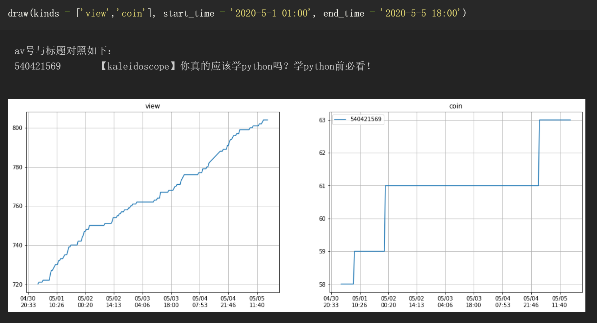

# bilibili-data-assistant (B站稿件实时数据记录及可视化)
B站up主的好助手。记录所有自己投稿稿件的各类历史数据(播放量、点赞、投币、评论、收藏、转发、评论数)并进行可视化。

特点：
1. 实时记录所有自己投稿稿件的各类数据(播放量、点赞、投币、评论、收藏、转发、评论数)。

2. 从`创作中心--稿件管理`获取数据，所以新投稿的视频也会自动开始记录。

3. 数据可视化，通过参数灵活调整显示的数据类型和时间段。
4. 如果程序意外退出，重新运行即可，之前的数据会被保留。

## 总览
基于Python3，所需的第三方包有：`Pandas`和`Matplotlib`。

主要程序有两个：`main.py`和`read.py`。

`main.py`负责每间隔一段时间将数据记录并保存到`time_series.pkl`中，需要一直保持后台运行。

`read.py`负责读取`time_series.pkl`中的数据并通过`Matplotlib`进行数据可视化。

## 使用
### 0 环境
基于python3，所需的第三方包有：`Pandas`和`Matplotlib`。上述两个库需要额外安装。
将程序通过`git`命令等下载到本地。
### 1 `main.py`
用浏览器登录B站，查看你的cookie。

**修改**`main.py`中第21行对应的cookie。

**修改**最后一行`time.sleep()`中的秒数，以修改获取数据的间隔时间。默认为1800秒，即每半小时更新记录一次数据。

运行`main.py`，注意使其保持一直运行。

程序会生成`time_series.pkl`文件，是保存的数据文件。

如果程序意外退出，重新运行即可，之前的数据会被保留。

### 2 `read.py`
`read.py`的主要功能用了`draw(kinds, start_time, end_time)`函数进行包装，通过**修改参数**画出不同类型数据，指定时间段的图。

`kind`参数默认为`'all'`,即在一张图中绘制多子图显示所有的数据。
也可选填`list`类型，其中元素可以填`'view'` `'like'` `'coin'` `'favourite'` `'share'` `'danmu'` `'reply'`以在一张图表中绘制多子图同时显示指定的数据。

`start_time`参数默认为`'default'`，即所从第一条数据开始。
`end_time`参数默认为`'default'`，即截止到最后一条数据。
上述两个参数也可选填指定的时间，格式为`'YYYY-mm-dd MM:HH'` 如 `'2020-05-05 15:05'`

运行`read.py`即可得到图表。（*附`read.ipynb`方便在Jupyter Notebook中运行*）

参数填写及效果如下图：

> 注：读取和保存`time_series.pkl`用的都是相对路径。即：请保证`main.py` `read.py` `time_series.pkl`在同一个文件夹中。

> 第一次在GitHub上发布repository。有任何问题欢迎联系我。

> 欢迎关注[我们的B站](http://lizhiping.top/jump.html)：三个半理工男 + 半个艺术生 = kaleidoscopeTech 科技万花筒